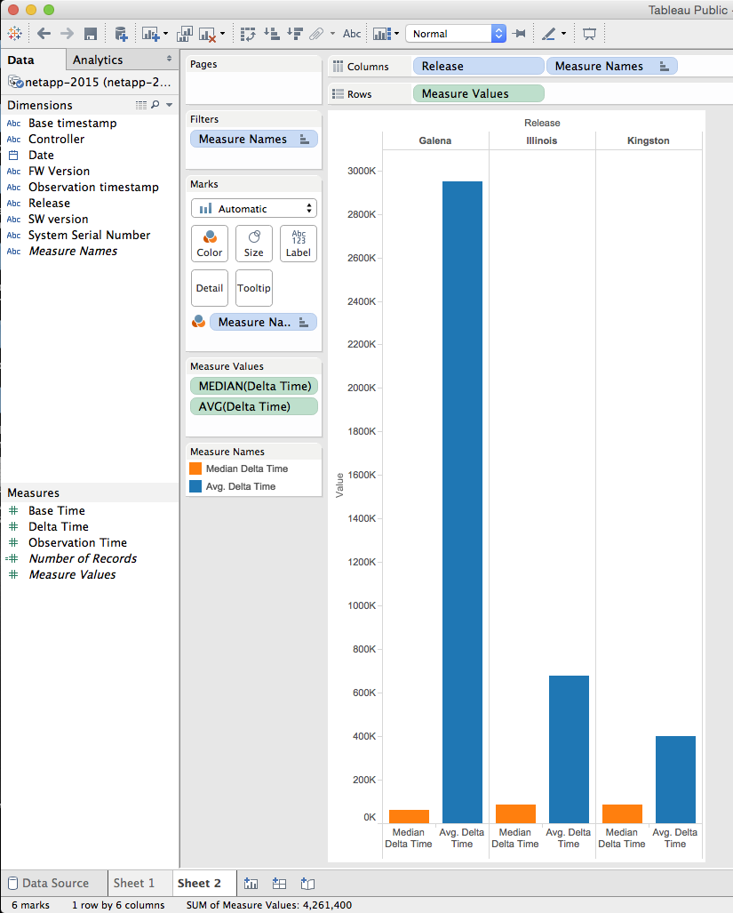
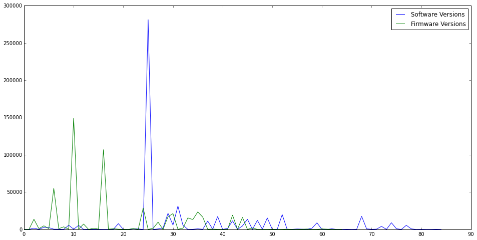

# NetApp

Brian McKean, a senior engineer at NetApp, gave a talk about his company in class.
He shared a data problem for our class to help solve.

# Tool
* Tableau
* Python

# Authors

This report is prepared by
* [William Farmer](http://github.com/willzfarmer)
* [Kevin Gifford](http://github.com/kevinkgifford)
* [Parker Illig](http://github.com/pail4944)
* [Robert Kendl](http://github.com/DomoYeti)
* [Andrew Krodinger](http://github.com/drewdinger)
* [John Raesly](http://github.com/jraesly)

# [Kevin Gifford](http://github.com/kevinkgifford):

## (Q2-1) Is there any temporal relationship (consistency or inconsistency) that
can be observed in regards to "good" and "bad" data (e.g., are any of the
issues of bad data related to timing in some fashion)?

Use Excel to read the 'netapp.csv' file so can translate Unix seconds into a
human readable timestamp:

    Excel: Open: netapp.csv

Add two columns in the Excel file for the 'Observation Time Stamp' and the
'Base Time Stamp' translating Unix seconds to human-readable timestamp via the
below formula (the +0 is a GMT offset of 0, GMT-0):

    = ( ( ( (UnixSeconds)/86400) + (DATE(1970,1,1) - (DATE(1900,1,1) ) ) ) +0 )

Save the file as 'netapp.xlsx' and use Tableau to plot the 'Observation Time
Stamp' and the 'Base Time Stamp' to check the timestamps "sensibility".

Figure 2-1: Base Time Stamps from 'netapp.csv'


Figure 2-1 shows three different views of the 'Base Time Stamps' and one view
of 'Observation Time Stamp' in the 'netapp.csv' file.  From left-to-right:
* The chart on the left shows the 'Base Time Stamps' from the entire file: note
the 'Base Time Stamps' range from 1970 to 2017.
* The chart second from the left shows a zoomed view of the 'Base Time Stamps':
Note all of the 'Base Time Stamps' samples dated 2005, 2009 and 2012.
* The chart second from the right shows a zoomed view of 2014 and 2015 'Base
Time Stamps': Note the significant number of samples dated in 2014 and the band
for samples in October, 2015.
* The chart on the right shows the 'Observation Time Stamp' distribution which
follows a similar general pattern as the 'Base Time Stamps' distribution: Note
the band of 'Observation Time Stamp' in 2044.

Analysis: There are lots of data samples for which the Observation Time Stamp
doesn't make sense given that the data file is stated to range from January -
July 2015.  Note that it was required to translate the Unix seconds to a
human-readable time format to discern this observation.  Recommendation: 
* (1) Throw all of this data out when analyzing Jan-Jul 2015 ASUP data 
* (2) Figure out why so many erroneous 'Base Time Stamps' and 'Observation Time
Stamp' observations.

## (Q2-2): Is there a relationship between 'delta time' and 'Release'?

To investigate Q2-2, I'd like to get rid of any data samples not timestamped in
2015. To do so I did the following:
* Save the updated Excel file (with the computed 'Observation Time Stamp' and
the 'Base Time Stamp') as a space-delimited msdos '.txt' file:

    Excel: Save As: MS-DOS Formatted Text (.txt) --> 'netapp-msdos.txt'

We now have a text file in MS-DOS format which uses a Carriage-Return (\r)
instead of a newline (\n) to delimit new lines.  We also need to get rid of any
samples not in the period of Jan-Jul, 2015.  We'll use a couple of standard
Unix/Linux text processing tools to translate the carraige returns to newlines
and then filter all of the lines which are each a sample row of netapp.csv
text:

    prompt> cat netapp-msdos.txt | tr '\r' '\n' | grep 2015 | grep -v Oct > netapp-2015

We can then open the space-delimited 'netapp-2015' file with Excel and save as
an Excel file just so we can read into Tableau.



The problem with the above graph is that the average deltatime is badly skewed
by exorbitantly large deltatime values.  This is an area where additional
scripts are required to filter the data in order to give meaningful
visualizations.  However, at a glance the 'Galena' Release seems to have
significantly more samples with exorbitantly large deltatimes than the
'Illinois' or the 'Kingston' Release.

# [Parker Illig](http://github.com/pail4944)


I would explain this as a question Tableau couldn't, or at least couldn't
easily, visualize. The graph shows each group of software versions and gives
each version two bars, the average delta time in blue and the average median
time in orange. In order to show the median, which was much smaller than most
averages, I had to use logarithmic scaling to get any kind of comparison
between the two values. Most of the bars in the graph show their medians'
around the 24 hours mark, but averages usually were much greater than the mean
due to the logarithmic scaling. This shows that most software versions had data
points that were huge, meaning that each software version had significant
issues. Due to these consistently bad results, I was unable to show any
correlation between software version and delta time without using custom
scripts to do more intensive filtering.

# [Robert Kendl](http://github.com/DomoYeti)


Here's the firmware version graph. I computed the average delta times for each
firmware version and put it into three colors. The green bars are way too high
for a delta time of about a day (over 100,000 I believe) and the red bars are
too low (under 60,000). As you can see, there's only one bar that is yellow,
which means it gives pretty reliable delta times of around 84,000.

# [John Raesly](http://github.com/jraesly)

## Is there a correlation between delta time and date?

It does seem that there is a correlation between date and delta time. The delta
time has decreased over time dramatically. This brings a follow up question of
why this is happening?


# [Will Farmer](http://github.com/willzfarmer)

## Set Up Imports

```python
import numpy as np
import pandas as pd
import bqplot.pyplot as blt
import matplotlib.pyplot as plt

import time
import datetime as dt

import pysparkling

conn = pysparkling.Context()

from ipywidgets import interact

%matplotlib inline
```

## Load Data

We're going to use the `pandas` module to load the data, as its csv stuff is really nice.


```python
data = pd.read_csv('netapp.csv', header=0,
                   names=['date', 'system', 'controller', 'obs_time',
                          'base_time', 'delta', 'release', 'fw', 'sw'],
                   dtype={'system': object})
```

Now we want to look at the what the rows look like.


```python
data.head()
```


<div>
<table border="1" class="dataframe">
  <thead>
    <tr style="text-align: right;">
      <th></th>
      <th>date</th>
      <th>system</th>
      <th>controller</th>
      <th>obs_time</th>
      <th>base_time</th>
      <th>delta</th>
      <th>release</th>
      <th>fw</th>
      <th>sw</th>
    </tr>
  </thead>
  <tbody>
    <tr>
      <th>0</th>
      <td>01/01/2015</td>
      <td>1016FG000254</td>
      <td>A</td>
      <td>1420149619</td>
      <td>1420063224</td>
      <td>86395</td>
      <td>Galena</td>
      <td>07.86.34.00</td>
      <td>10.86.0G00.0028</td>
    </tr>
    <tr>
      <th>1</th>
      <td>01/01/2015</td>
      <td>1016FG000432</td>
      <td>A</td>
      <td>1420125162</td>
      <td>1420091715</td>
      <td>33447</td>
      <td>Galena</td>
      <td>07.86.36.30</td>
      <td>10.86.0G00.0048</td>
    </tr>
    <tr>
      <th>2</th>
      <td>01/01/2015</td>
      <td>1017FG000057</td>
      <td>A</td>
      <td>1420102145</td>
      <td>1420015747</td>
      <td>86398</td>
      <td>Galena</td>
      <td>07.86.29.00</td>
      <td>10.86.0G08.0017</td>
    </tr>
    <tr>
      <th>3</th>
      <td>01/01/2015</td>
      <td>1030FG000606</td>
      <td>A</td>
      <td>1420111809</td>
      <td>1420044906</td>
      <td>66903</td>
      <td>Galena</td>
      <td>07.86.45.30</td>
      <td>10.86.0G00.0048</td>
    </tr>
    <tr>
      <th>4</th>
      <td>01/01/2015</td>
      <td>1030FG000619</td>
      <td>A</td>
      <td>1420112025</td>
      <td>1420111359</td>
      <td>666</td>
      <td>Galena</td>
      <td>07.86.45.30</td>
      <td>10.86.0G00.0048</td>
    </tr>
  </tbody>
</table>
</div>


## Analyze Data

We will first examine the integrity of the overall dataset.

### Delta Time Distribution

This first plot looks at the time distribution of the deltas. Ideally we would see a flat line at approx. 86,000. We don't see that.


```python
plt.figure(figsize=(16, 8))
plt.scatter(data['obs_time'], data['delta'], s=1)
plt.xlabel('Linux Epoch Time')
plt.ylabel('Deltas')
plt.show()
```


### Mean and Standard Deviation

We now examine the mean and standard deviation of the deltas for each system. First we generate our data. We will be setting a standard deviation threshold of one hour. Any system data that falls in the deviation we will call "good".


```python
thresh = 3600
grouping = data.groupby('system')
size = len(grouping)
stat_data = np.zeros((size, 4))
i = 0
for key, group in grouping:
    deltas = group['delta']
    stat_data[i][0] = deltas.mean()
    stat_data[i][1] = deltas.std()
    stat_data[i][2] = len(deltas)
    stat_data[i][3] = (255 if deltas.std() <= thresh else 0)
    i += 1
```

We can plot these results.


```python
fig, axarr = plt.subplots(1, 2, figsize=(16, 8))
axarr[0].scatter(stat_data[:, 0], stat_data[:, 1],
                 c=stat_data[:, 3], cmap=plt.cm.coolwarm,
                 alpha=0.2)
axarr[1].scatter(stat_data[:, 0], stat_data[:, 1],
                 c=stat_data[:, 3], cmap=plt.cm.coolwarm,
                 alpha=0.2)
domain = np.arange(-1e7, 7e7)
axarr[0].plot(domain, thresh * np.ones(len(domain)), 'k--')
axarr[1].plot(domain, thresh * np.ones(len(domain)), 'k--')
axarr[0].set_xlabel('Mean Delta Time')
axarr[0].set_ylabel('Standard Deviation')
axarr[1].set_xlabel('Mean Delta Time')
axarr[1].set_ylabel('Standard Deviation')
axarr[1].set_ylim(0, thresh * 2)
plt.show()
```


From this we can interpret several things.

1. The standard deviation of each system is terrible. Only a very small set of systems have consistently "good" data. This means that most systems have bad data.
2. On the other hand, most systems are clustered at the (relative) origin. This is helpful, but many systems are still bad.

Now that we know many systems result in poor data consistency, we can branch out and examine just the rows that we consider "valid", i.e., those rows in which the `delta` field is approximately 86,000 (the length of a day in seconds).

## Good Row Analysis

We start by pulling out only the valid rows. (We also get the "bad" rows, but we'll use those later.)


```python
clean_raw_data = data.values[np.where(np.abs(data.values[:, 5] - 86400) <= 3600)[0]]
dirty_raw_data = data.values[np.where(np.abs(data.values[:, 5] - 86400) > 3600)[0]]
```


```python
clean_data = pd.DataFrame(clean_raw_data,
                        columns=['date', 'system', 'controller', 'obs_time',
                                 'base_time', 'delta', 'release', 'fw', 'sw'])
print(len(clean_data))
clean_data.head()
```

    533203


<div>
<table border="1" class="dataframe">
  <thead>
    <tr style="text-align: right;">
      <th></th>
      <th>date</th>
      <th>system</th>
      <th>controller</th>
      <th>obs_time</th>
      <th>base_time</th>
      <th>delta</th>
      <th>release</th>
      <th>fw</th>
      <th>sw</th>
    </tr>
  </thead>
  <tbody>
    <tr>
      <th>0</th>
      <td>01/01/2015</td>
      <td>1016FG000254</td>
      <td>A</td>
      <td>1.42015e+09</td>
      <td>1.420063e+09</td>
      <td>86395</td>
      <td>Galena</td>
      <td>07.86.34.00</td>
      <td>10.86.0G00.0028</td>
    </tr>
    <tr>
      <th>1</th>
      <td>01/01/2015</td>
      <td>1017FG000057</td>
      <td>A</td>
      <td>1.420102e+09</td>
      <td>1.420016e+09</td>
      <td>86398</td>
      <td>Galena</td>
      <td>07.86.29.00</td>
      <td>10.86.0G08.0017</td>
    </tr>
    <tr>
      <th>2</th>
      <td>01/01/2015</td>
      <td>1032FG000284</td>
      <td>A</td>
      <td>1.420105e+09</td>
      <td>1.420018e+09</td>
      <td>86395</td>
      <td>Galena</td>
      <td>07.86.32.00</td>
      <td>10.86.0G00.0024</td>
    </tr>
    <tr>
      <th>3</th>
      <td>01/01/2015</td>
      <td>1032FG000288</td>
      <td>B</td>
      <td>1.420074e+09</td>
      <td>1.419988e+09</td>
      <td>86396</td>
      <td>Galena</td>
      <td>07.86.34.00</td>
      <td>10.86.0G00.0013</td>
    </tr>
    <tr>
      <th>4</th>
      <td>01/01/2015</td>
      <td>1032FG000308</td>
      <td>A</td>
      <td>1.420151e+09</td>
      <td>1.420065e+09</td>
      <td>86396</td>
      <td>Galena</td>
      <td>07.86.32.00</td>
      <td>10.86.0G00.0024</td>
    </tr>
  </tbody>
</table>
</div>


We see that we've immediately removed half of the rows. This is arguably good. Notice the term "arguably"...

### Reduction Comparison

We'll start by looking at which systems "lost" the most data. We will do this by comparing the system groupings.


```python
original_grouping = data.groupby('system')
clean_grouping = clean_data.groupby('system')
keys = data['system'].unique()
```

We will now extract the difference from this array.


```python
key_groups = np.zeros((len(keys), 2))
i = 0
for k in keys:
    key_groups[i][0] = len(original_grouping.get_group(k))
    try:
        key_groups[i][1] = len(clean_grouping.get_group(k))
    except KeyError:
        pass
    i += 1
```


```python
key_groups_difference = key_groups[:, 0] - key_groups[:, 1]
```

And now we can plot this.


```python
plt.figure(figsize=(16, 8))
plt.scatter(np.arange(len(key_groups_difference)), key_groups_difference, s=1)
plt.show()
```


We will also do a histogram.


```python
hist, bins = np.histogram(key_groups_difference, bins=200)
center = (bins[:-1] + bins[1:]) / 2
plt.figure(figsize=(16, 8))
plt.bar(center, hist, align='center')
plt.show()
```


From this we can interpret that *many* systems have no change, while many lose their data.

## Release Analysis

Now let's look at the dirty data. We will see if the software and firmware versions affect the number of bad rows.


```python
dirty_data = pd.DataFrame(dirty_raw_data,
                        columns=['date', 'system', 'controller', 'obs_time',
                                 'base_time', 'delta', 'release', 'fw', 'sw'])
print(len(dirty_data))
dirty_data.head()
```

    536778


<div>
<table border="1" class="dataframe">
  <thead>
    <tr style="text-align: right;">
      <th></th>
      <th>date</th>
      <th>system</th>
      <th>controller</th>
      <th>obs_time</th>
      <th>base_time</th>
      <th>delta</th>
      <th>release</th>
      <th>fw</th>
      <th>sw</th>
    </tr>
  </thead>
  <tbody>
    <tr>
      <th>0</th>
      <td>01/01/2015</td>
      <td>1016FG000432</td>
      <td>A</td>
      <td>1.420125e+09</td>
      <td>1.420092e+09</td>
      <td>33447</td>
      <td>Galena</td>
      <td>07.86.36.30</td>
      <td>10.86.0G00.0048</td>
    </tr>
    <tr>
      <th>1</th>
      <td>01/01/2015</td>
      <td>1030FG000606</td>
      <td>A</td>
      <td>1.420112e+09</td>
      <td>1.420045e+09</td>
      <td>66903</td>
      <td>Galena</td>
      <td>07.86.45.30</td>
      <td>10.86.0G00.0048</td>
    </tr>
    <tr>
      <th>2</th>
      <td>01/01/2015</td>
      <td>1030FG000619</td>
      <td>A</td>
      <td>1.420112e+09</td>
      <td>1.420111e+09</td>
      <td>666</td>
      <td>Galena</td>
      <td>07.86.45.30</td>
      <td>10.86.0G00.0048</td>
    </tr>
    <tr>
      <th>3</th>
      <td>01/01/2015</td>
      <td>1030FG000621</td>
      <td>A</td>
      <td>1.420112e+09</td>
      <td>1.420111e+09</td>
      <td>1205</td>
      <td>Galena</td>
      <td>07.86.45.30</td>
      <td>10.86.0G00.0048</td>
    </tr>
    <tr>
      <th>4</th>
      <td>01/01/2015</td>
      <td>1030FG000630</td>
      <td>A</td>
      <td>1.420112e+09</td>
      <td>1.420076e+09</td>
      <td>36243</td>
      <td>Galena</td>
      <td>07.86.45.30</td>
      <td>10.86.0G00.0048</td>
    </tr>
  </tbody>
</table>
</div>


Now we group by software version. We also convert this to an array, as we're interested in the number of bad values per software version. (Note, we make some assumptions about these software versions. This sorting *may* be incorrect.)


```python
sw_groups = dirty_data.groupby('sw')
sw_data = np.array(sorted([(int(''.join(t[0].split('.')[:2]) + t[0].split('.')[-1]),
                           t[0], len(t[1]))
                          for t in list(sw_groups)],
                    key=lambda t: t[0]))
numeric_sw_data = np.array(sw_data[:, 2], dtype=int)
```


```python
fw_groups = dirty_data.groupby('fw')
fw_data = np.array([(t[0], len(t[1]))
                    for t in list(fw_groups)
                    if t[0] != 'no storage_array_profile.txt'])
numeric_fw_data = np.array(fw_data[:, 1], dtype=int)
```


```python
plt.figure(figsize=(16, 8))
plt.plot(np.arange(len(numeric_sw_data)), numeric_sw_data,
            label='Software Versions')
plt.plot(np.arange(len(numeric_fw_data)), numeric_fw_data,
            label='Firmware Versions')
plt.legend()
plt.show()
```





Hey! That's perfect! That shows that the number of *bad* rows was really really high for specific versions, but have since been reduced to a lower amount. That's exactly what we wanted to see. As per request, now let's normalize this. In other words, let's examine the percent of bad rows for each release.

## Normalized Releases

First we'll get the software groups.


```python
def sw_to_key(s):
    arr = s.split('.')
    return int(''.join(arr[:2]) + arr[-1])
def fw_to_key(s):
    return int(''.join(s.split('.')))
```


```python
dirty_sw = dirty_data.groupby('sw')
total_sw = data.groupby('sw')
sw_versions = sorted([(t[0], sw_to_key(t[0])) for t in total_sw], key=lambda t: t[1])
normal_sw = np.zeros((len(sw_versions), 3), dtype=np.float128)
for i in range(len(sw_versions)):
    key = sw_versions[i][0]
    normal_sw[i][0] = sw_to_key(key)
    total_group = total_sw.get_group(key)
    normal_sw[i][2] = len(total_group)
    try:
        dirty_group = dirty_sw.get_group(key)
    except KeyError:
        normal_sw[i][1] = 0
    else:
        normal_sw[i][1] = (len(dirty_group) / len(total_group))
```

Now we can get the firmware groups.


```python
dirty_fw = dirty_data.groupby('fw')
total_fw = data.groupby('fw')
fw_versions = sorted([(t[0], fw_to_key(t[0]))
                       for t in total_fw
                       if not t[0].startswith('no storage')],
                     key=lambda t: t[1])
normal_fw = np.zeros((len(fw_versions), 3), dtype=np.float128)
for i in range(len(fw_versions)):
    key = fw_versions[i][0]
    normal_fw[i][0] = fw_to_key(key)
    total_group = total_fw.get_group(key)
    normal_fw[i][1] = len(total_group)
    try:
        dirty_group = dirty_fw.get_group(key)
    except KeyError:
        normal_fw[i][1] = 0
    else:
        normal_fw[i][1] = (len(dirty_group) / len(total_group))
```

And now we can plot.


```python
fig, axarr = plt.subplots(2, 1, figsize=(16, 8))
axarr[0].plot(np.arange(len(normal_sw)), normal_sw[:, 1], 'b-')
axarr[0].scatter(np.arange(len(normal_sw)), normal_sw[:, 1], s=100,
                 c=normal_sw[:, 2], cmap=plt.get_cmap('Blues'))
axarr[0].set_xlim(-1, 90)
axarr[0].set_title('Normalized Software Versions')
axarr[1].plot(np.arange(len(normal_fw)), normal_fw[:, 1], 'g-')
axarr[1].scatter(np.arange(len(normal_fw)), normal_fw[:, 1], s=100,
                 c=normal_fw[:, 2], cmap=plt.get_cmap('Greens'))
axarr[1].set_title('Normalized Firmware Versions')
plt.show()
```


These plots can be interpreted by looking at the $y$ axis. In each graph, the $y$ axis corresponds to the percentage of *bad* rows for the specific software or firmware version. We can see that there appears to be no strong correlation between versions and the number of bad rows.

Each point is also shaded, where the darker the node is the more data exists for that version.


```python

```
